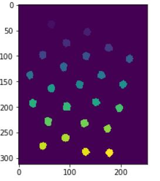
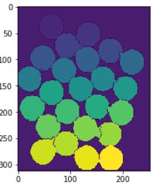

# Segmentation_using_Watershed

Learning the working of the watershed algorithm for an image

Starting from sure foreground and sure background classification.

and getting a good segmentation using watershed algorithm

